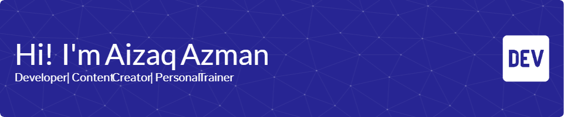

<!-- **aizaqazman/aizaqazman** is a ✨ _special_ ✨ repository because its `README.md` (this file) appears on your GitHub profile.

Here are some ideas to get you started:

- 🔭 I’m currently working on ...
- 🌱 I’m currently learning ...
- 👯 I’m looking to collaborate on ...
- 🤔 I’m looking for help with ...
- 💬 Ask me about ...
- 📫 How to reach me: ...
- 😄 Pronouns: ...
- ⚡ Fun fact: ... 

<!-- - 🔭 I’m currently working on **@Byton Byte Management**
- 🌱 I’m currently learning **React** Framework

##### Skills

##### Frameworks & Library

##### Database

##### Connect with me

   -->

<!-- ##### My Github Stats

 --> 

<h1 align="left">Hey 👋 What's up?</h1>

###

My name is Aizaq Azman and I'm a Fullstack Developer from Byton Byte Management

###

<h2 align="left">About me</h2>

###

✨ Creating bugs since 2019 📚 I'm currently learning React Framework 🎯 Goals: To help other create functional system  🎲 Fun fact: I'm also gym personal trainer

###

<h2 align="left">I code with</h2>

###

  
  
  
  
  
  
  
  
  
  
  
  
  
  
  
  
  
  
  
  
  

###

<h2 align="left">Database</h2>

###

  
  
  

###

<h2 align="left">Social</h2>

###

  
  
  
  

###

  
  

###

<picture>
  <source media="(prefers-color-scheme: dark)" srcset="https://raw.githubusercontent.com/aizaqazman/aizaqazman/output/pacman-contribution-graph-dark.svg">
  <source media="(prefers-color-scheme: light)" srcset="https://raw.githubusercontent.com/aizaqazman/aizaqazman/output/pacman-contribution-graph.svg">
  
</picture>

###